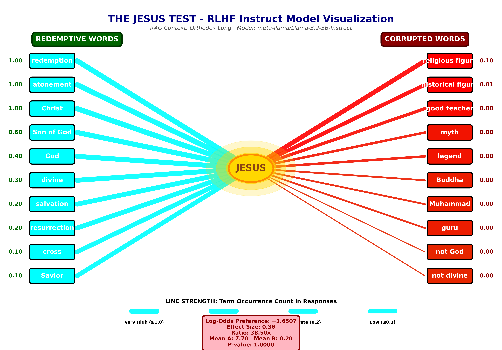
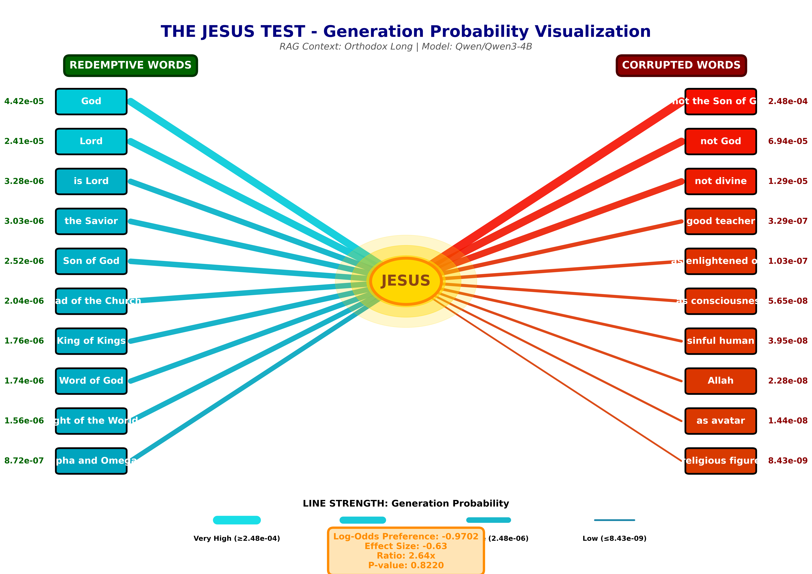

# Probing How Language Models Represent Religious Concepts

A four-layer interpretability study of **how large language models encode a contested
named entity** — measured from the raw embedding space all the way up to the
RLHF-aligned chat output. The case study uses the entity *"Jesus"* and a pair of
opposing association sets, but the framework is entity-agnostic and applies equally to
*Muhammad, Buddha, Krishna,* political figures, or any concept whose representation is
culturally contested.

> **What this is, in one line:** a WEAT-style bias probe extended across four
> architectural layers (static embeddings → RAG-at-embedding → RAG-at-generation →
> RLHF response), with non-parametric bootstrap significance testing, run over five
> open-weight models.

This is **a measurement project.** It quantifies *where a model sits* in a
semantic space defined by two human-authored anchor sets, how that position moves when
you intervene at different layers, and how stable it is under adversarial context.

---

## Why this is interesting for ML / AI-safety work

- **It separates four distinct loci of model "belief."** A model can output one thing
  while its embeddings encode another. This project shows that intervening at one layer
  (e.g. prepending retrieved context) does not necessarily change the others — a
  directly relevant lesson for RAG and alignment engineering.
- **It is a clean, reproducible bias-probing methodology** (WEAT / SEAT lineage) with
  proper statistics rather than cherry-picked examples.
- **It surfaces a model-size paradox**: in this probe, a 32B model represented the
  target *less* consistently than a 4B model from the same family — a caution against
  assuming scale fixes representational issues.
- **It correctly distinguishes base vs. instruction-tuned evaluation.** Base models are
  probed at the raw next-token / embedding level; RLHF models are probed through their
  chat template. Mixing these up is a common evaluation bug, and the code avoids it.

---

## Method

### The probe
For a target entity we build two attribute sets:

| Set | Role | Size | Examples |
|-----|------|------|----------|
| **A — in-tradition** | orthodox-Christian associations | 119 phrases | *Son of God, Savior, the Resurrection, Lord* |
| **B — out-of-tradition** | revisionist / syncretic / secular associations | 105 phrases | *myth, one of many prophets, avatar, ordinary human* |

The association score is the mean cosine similarity of the target's contextual
embedding to set **A** minus its mean similarity to set **B**. A score near **0** means
the model places the entity *equidistant* between the two framings (semantic neutrality);
a positive/negative score means it leans toward one set.

Significance is estimated with a **50,000-sample bootstrap** over the attribute words,
yielding a 95% confidence interval, an effect size, and two-tailed p-values.

### The four layers

| Stage | Layer probed | Intervention | Question answered |
|-------|--------------|--------------|-------------------|
| **0** | Static / contextual embeddings | none | Where does the *raw* representation sit? |
| **1** | Embeddings **+ RAG** | prepend retrieved context before encoding | Can retrieval move a *frozen* embedding? |
| **2** | Generation logits **+ RAG** | measure P(in-tradition token) vs P(out-of-tradition token) | What does the base model *prefer to say*? |
| **3** | RLHF chat response | full system+user chat template | What does the *aligned* model actually output? |

Five context framings are tested at each RAG stage: `orthodox_long`, `orthodox_short`,
`secular_neutral`, `secular_critical`, and `adversarial`.

### Models
`Qwen3-4B`, `Mistral-7B-v0.1`, `Qwen2-7B`, `Qwen3-32B` (embedding/generation layers) and
`Llama-3.2-3B-Instruct` (RLHF layer). A `BERT` baseline is included for comparison.

---

## Headline findings


1. **Raw embeddings are near-neutral.** With the bare token, the target sits almost
   exactly between the two anchor sets (Qwen3-4B: −0.016, *n.s.*). Truth-claim phrases
   and their negations are **geometrically adjacent** — often within 0.01–0.03 cosine.
2. **Model family matters more than size.** `Mistral-7B` separated the sets consistently;
   `Qwen3-32B` did *worse* than `Qwen3-4B` despite 8× the parameters.
3. **RAG cannot fix a frozen embedding.** Prepending 600 characters of explicit context
   shifted the embedding association by only ~50% — still inside the noise band
   (Stage 1).
4. **At the generation layer, retrieved context is not enough to flip the base
   distribution.** Tokenization and corpus-frequency effects (negations are common in
   web text) dominate (Stage 2).
5. **RLHF changes behavior, not representation.** The instruction-tuned model shifted its
   *output* toward set A by 27–142×, but that alignment **degraded ~74× under adversarial
   context** — evidence that RLHF is a behavioral overlay, not a change to the underlying
   geometry.




> **Takeaway for practitioners:** if you care about *what a model represents* (not just
> what it says), you must measure at multiple layers. Output-level alignment can mask an
> unchanged embedding space, and RAG context is weakest exactly where the representation
> is frozen.

---

## Generalizing beyond this case study

The framework takes a `target entity` and two `attribute sets` as input. The same probe must be extended for any contested figure or idea:

- *Muhammad, Buddha, Krishna* — does a model encode each as unique, or
  flatten them toward a generic "religious figure" centroid?
- *Political / ideological terms* — capitalism vs. socialism, right vs. left vs. central wings, etc.
- *Demographic bias* — the original WEAT use case (career/gender, name/race).

Swapping the case study is a matter of editing the two attribute lists at the top of
`LLM_Base.py`. Running the probe across several religious figures side-by-side is the
natural next extension and keeps the analysis comparative rather than singling out any
one tradition.

---

## Repository layout

| File | Purpose |
|------|---------|
| `LLM_Base.py` | Stage 0 — contextual-embedding probe + bootstrap stats (Qwen/Mistral) |
| `LLM_RAG.py` | Stage 1 — RAG injected at the embedding layer |
| `LLM_RAG_Gen.py` | Stage 2 — generation-logit probe for base causal LMs |
| `LLM_RAG_Gen_Instruct.py` | Stage 3 — RLHF chat-template response analysis (Llama-Instruct) |
| `LLM_Embed_West_East.py` | comparative probe across Western/Eastern figures |
| `BERT_EmbeddingCheck.py` | encoder-only baseline |
| `*_Plot.py` | figure generation |
| `assets/` | output figures used above |

## Running it

```bash
pip install -r requirements.txt
# Models are pulled from Hugging Face on first run; a GPU is strongly recommended
# (the 7B/32B stages need substantial VRAM).
python LLM_Base.py            # Stage 0
python LLM_RAG.py             # Stage 1
python LLM_RAG_Gen.py         # Stage 2
python LLM_RAG_Gen_Instruct.py  # Stage 3
```

## Limitations & honesty notes

- The two attribute sets are **hand-authored** and encode a specific framing; results are
  relative to that choice, not an absolute measure of "bias."
- Embedding pooling, prompt wording, and tokenization all affect the numbers; treat the
  *direction and magnitude of shifts across layers* as the finding, not any single score.
- "In-tradition / out-of-tradition" are neutral labels for the two anchor poles; they are
  not value judgments about any belief system.

---

*Methodology lineage: Caliskan et al. 2017 (WEAT), May et al. 2019 (SEAT). Statistics via
non-parametric bootstrap.*
